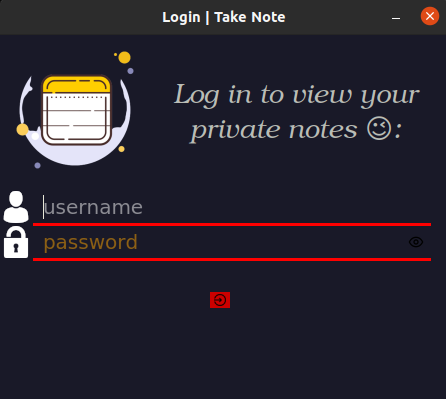

## my app `Take Note` ###
Hi friends :
Finally, I create new software that makes your life easier especially your coding experience.
imagine you find a new piece of code or a new command that can come in handy anytime even if you don't have internet access .. you can create a "note" that can be saved to a local database at your system for later use .. enjoy !

## requirements : ##
* modules :
    * mysql.connector 
    * PyQt5 
* installing with pip3 :
  * pip3 install mysql-connector-python
  * pip3 install PyQt5

## installation : ##
  * git clone https://github.com/Tarek-Brahmi/TakeNote.git
  * cd TakeNote
  * chmod +x -v setup.sh
  * ./setup.sh

## the `WELCOME` page ###
screenshot:

## the `LOGIN` page ###
screenshot:

## the `Splash Screen` page ###
screenshot:

## the `My private notes` page ###
screenshot:

## the `Add New Note` page ###
screenshot:

